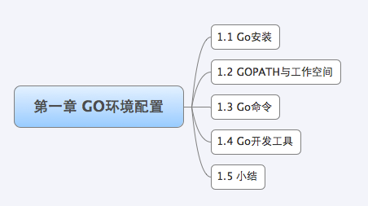

# 1 GO 環境配置

歡迎來到 Go 的世界，讓我們開始探索吧！

Go 是一種新的語言，一種併發的、帶垃圾回收的、快速編譯的語言。它具有以下特點：

- 它可以在一臺計算機上用幾秒鐘的時間編譯一個大型的 Go 程式。
- Go 為軟體構造提供了一種模型，它使依賴分析更加容易，且避免了大部分 C 風格 include 檔案與函式庫的開頭。
- Go 是靜態型別的語言，它的型別系統沒有層級。因此使用者不需要在定義型別之間的關係上花費時間，這樣感覺起來比典型的面嚮物件語言更輕量級。
- Go 完全是垃圾回收型的語言，併為併發執行與通訊提供了基本的支援。
- 按照其設計，Go 打算為多核機器上系統軟體的構造提供一種方法。

Go 是一種編譯型語言，它結合了解釋型語言的遊刃有餘，動態型別語言的開發效率，以及靜態型別的安全性。它也打算成為現代的，支援網路與多核計算的語言。要滿足這些目標，需要解決一些語言上的問題：一個富有表達能力但輕量級的型別系統，併發與垃圾回收機制，嚴格的依賴規範等等。這些無法透過函式庫或工具解決好，因此 Go 也就應運而生了。

在本章中，我們將講述 Go 的安裝方法，以及如何配置專案資訊。

## 目錄

## links
   * [目錄](<preface.md>)
   * 下一節：[安裝 Go](<01.1.md>)
